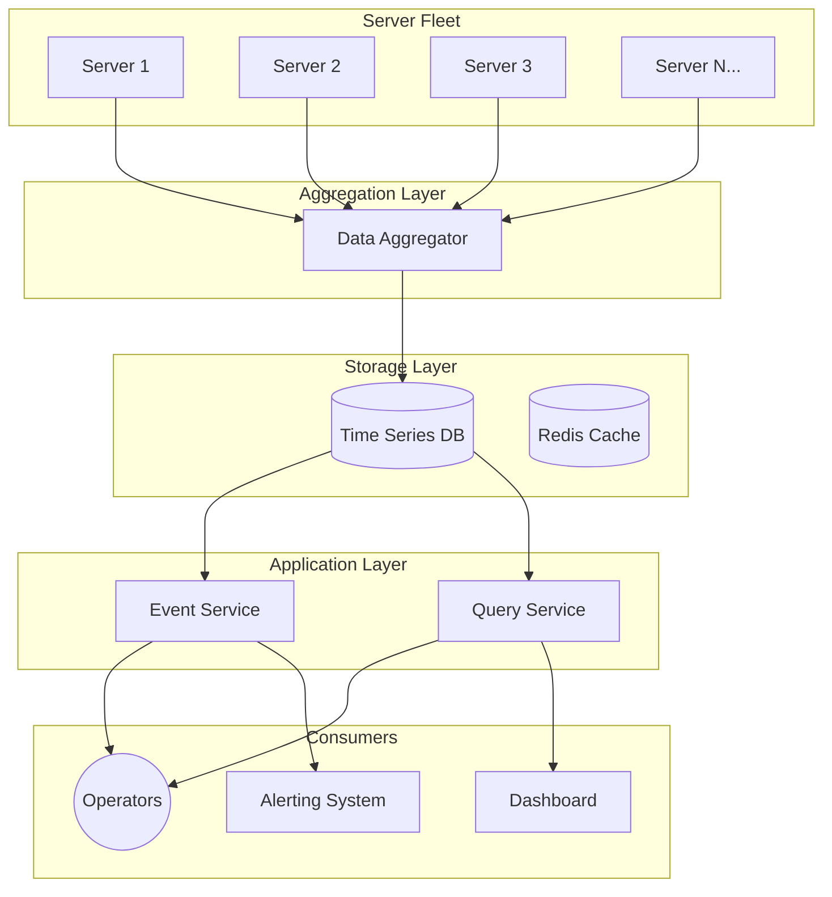
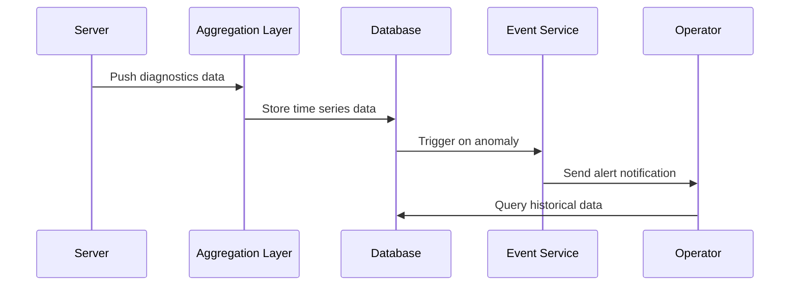
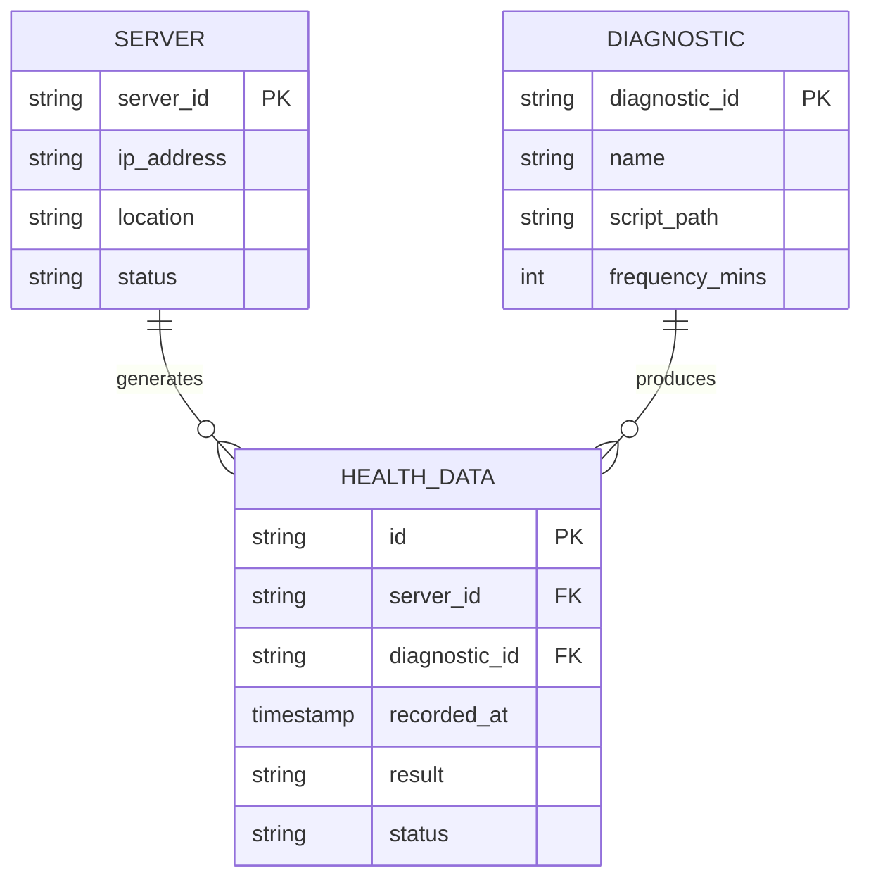

# Health Check System - High Level Design

## Problem Statement

Design a system to periodically run diagnostics and gather health data from a large fleet of servers (1000s).

## Requirements

- Monitor 1000s of servers across multiple locations
- Run 100s of diagnostic scripts hourly
- Report health status back to operators
- Support AP (Availability + Partition tolerance) from CAP theorem

## Architecture

## Data Flow

## Key Design Decisions

1. **Diagnostics Location**: Centralized service remotely runs diagnostics
2. **Data Storage**: Time series database for historical data
3. **Schema**: Simple `(server_ip, diagnostic_name, result, timestamp)`

## Data Model

## Scalability Considerations

- **Load Balancing**: Distribute diagnostic requests across aggregation nodes
- **Partitioning**: Shard data by server location/region
- **Caching**: Cache recent health status in Redis
- **Monitoring**: Canaries, dashboards, and alarms for system health

