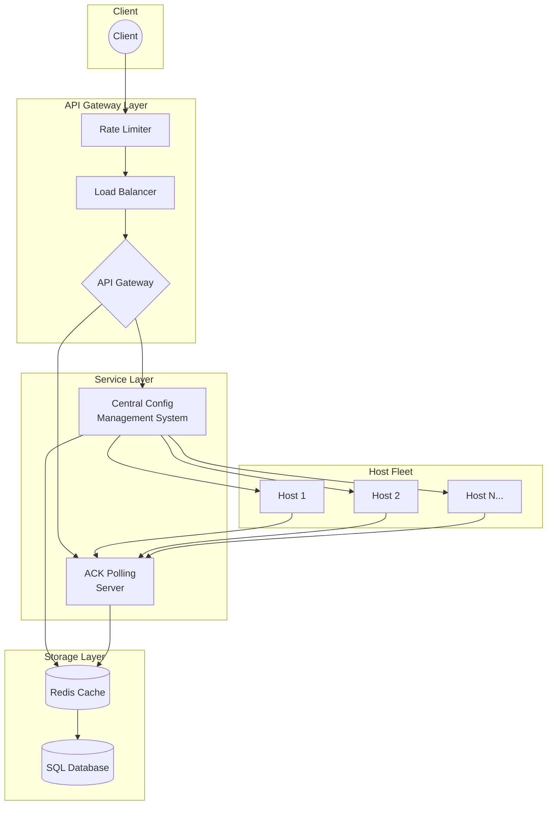
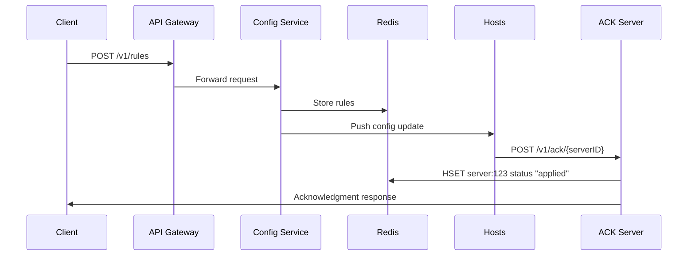

# Rule Propagation Service - High Level Design

## Problem Statement

Design a configuration distribution system that propagates rules to 60K+ servers across 200 locations with P100 latency under 30 seconds.

## Requirements

- 60K servers across 200 locations
- ~30 config updates per second
- Acknowledgment when rules are applied to all servers
- Sub-30 second propagation guarantee

## Architecture



## API Design



## Data Storage (Redis)

```
# Server status tracking
HSET server:123 status "applied" version "v2" ack "true"

# Acknowledged servers set
SADD acknowledged_servers server1 server2 server3

# Acknowledgment timestamps (sorted set)
ZADD ack_times 1623855600 server1 1623855610 server2

# Pending updates queue
LPUSH pending_updates server4 server5 server6

# Rate limiting
INCR user:123:requests
EXPIRE user:123:requests 60
```

## Response Format

```json
{
  "status": "success",
  "update_id": "123",
  "acknowledged_servers": ["server1", "server2", "server3"],
  "failed_servers": [],
  "propagation_time_ms": 28500
}
```

## Key Design Decisions

1. **Push Model**: CCMS pushes configs to hosts for faster propagation
2. **Redis Caching**: Real-time acknowledgment tracking
3. **SQL Archive**: Historical audit trail of all updates
4. **Rate Limiting**: Protect system from overload

## Scalability

- **Horizontal Scaling**: Multiple CCMS and ACK server instances
- **Regional Distribution**: Deploy close to host clusters
- **Connection Pooling**: Efficient host connections
- **Batch Processing**: Group acknowledgments for efficiency

