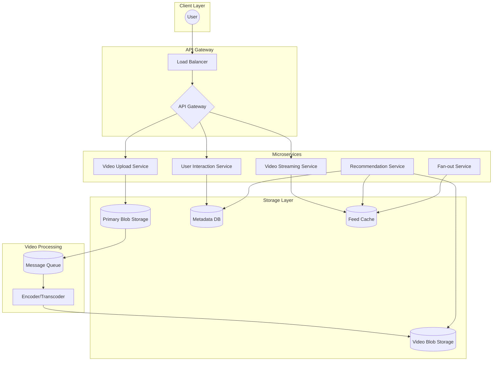
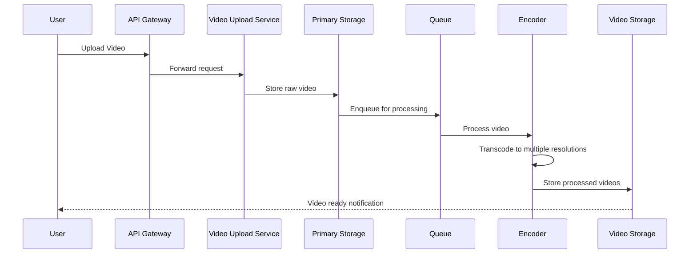
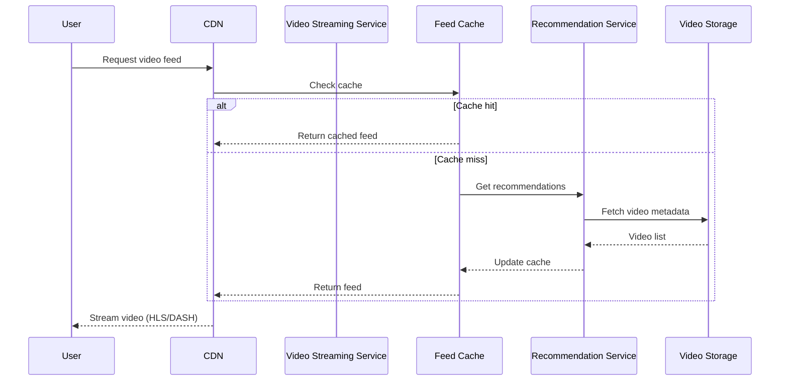
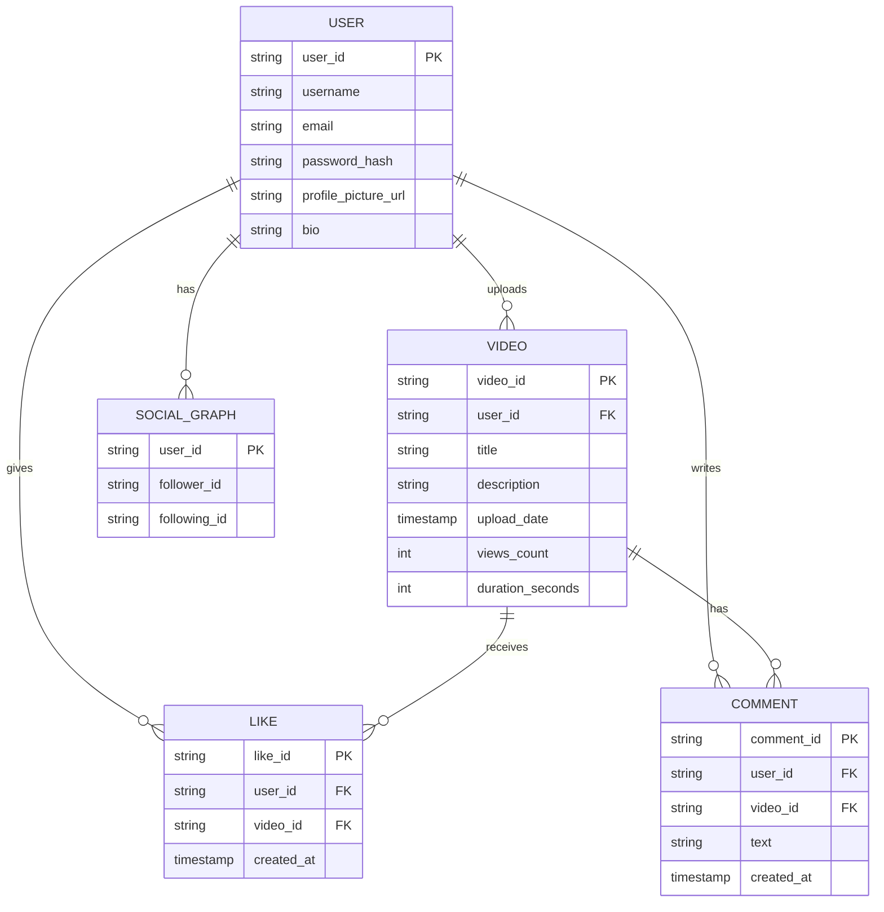

# TikTok System - High Level Design

## Overview

TikTok is a social media platform for short-form videos (15s to 1min) including dance, comedy, and educational content.

## Requirements

### Functional
1. User Profile management
2. Video Upload & Processing
3. Video Viewing/Streaming
4. Like, Comment, Share
5. Follow Users
6. Live Streaming
7. Recommendations

### Non-Functional
1. **Security**: End-to-end encryption
2. **Performance**: Fast view/stream latency
3. **Storage**: Handle petabytes of video data
4. **Scalability**: Handle large read/write requests
5. **Latency**: Minimal buffering for video playback

## Capacity Estimation

| Metric | Value |
|--------|-------|
| Monthly Active Users (MAU) | 1 billion |
| Daily Video Uploads | 50 million |
| Requests Per Second (RPS) | ~5,787 |
| Peak RPS | ~11,574 |
| User Profile Storage | 1 PB |
| Daily Video Storage | 1 PB |
| Monthly Video Storage | 30 PB |

## Architecture



## Video Upload Flow



## Video Streaming Flow



## Data Model



## API Endpoints

```
POST /api/user/register
POST /api/user/login
POST /api/video/upload
GET  /api/video/{videoId}
POST /api/videos/{videoId}/like
POST /api/videos/{videoId}/dislike
POST /api/videos/{videoId}/comment
GET  /api/feed
GET  /api/user/{userId}/followers
POST /api/user/{userId}/follow
```

## Key Components

### 1. Video Processing Pipeline
- **Encoder/Transcoder**: Converts videos to multiple resolutions (240p, 480p, 720p, 1080p)
- **HLS/DASH**: Adaptive bitrate streaming based on network conditions

### 2. Recommendation Engine
- Machine learning models for personalized content
- Collaborative filtering + content-based filtering

### 3. Feed Cache
- Redis clusters for fast feed retrieval
- Fan-out on write for active users
- Fan-out on read for celebrity accounts

### 4. Content Delivery Network (CDN)
- Edge caching for video content
- Geographic distribution for low latency

## Scalability Strategies

1. **Horizontal Scaling**: Microservices architecture
2. **Database Sharding**: By user_id or video_id
3. **Caching**: Multi-layer (CDN → Redis → DB)
4. **Async Processing**: Message queues for video processing
5. **Read Replicas**: For read-heavy workloads

