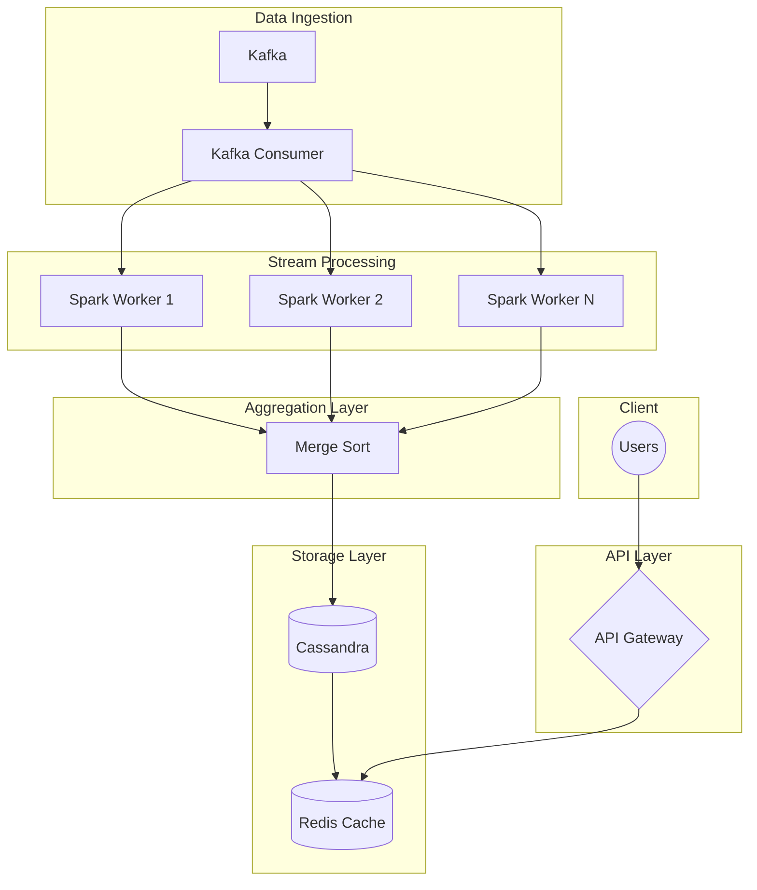
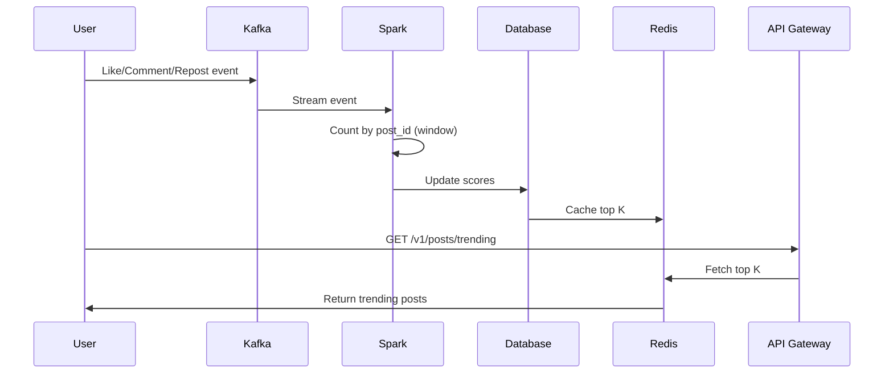
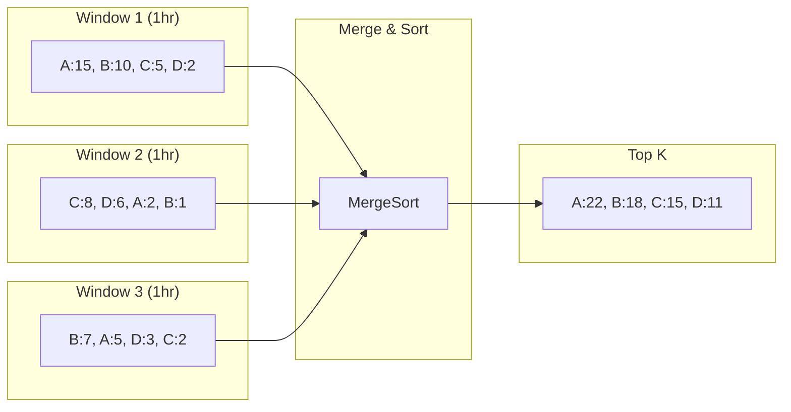
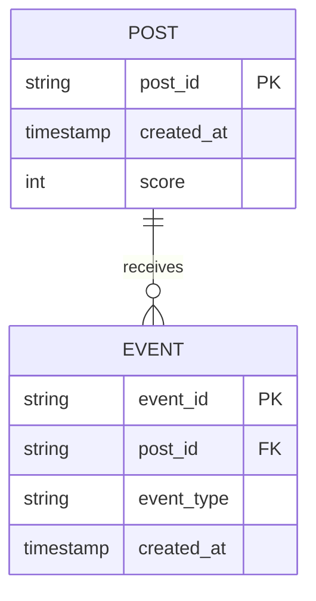

# Trending Posts System - High Level Design

## Problem Statement

Design a system to show top K trending posts on a social media platform with 1 billion users.

## Requirements

### Functional
- Get top K trending posts (configurable duration, default 24hrs)
- Posts contain text + images (image URLs)
- Trending = likes + comments + reposts (equal weight)

### Non-Functional
- ~10^6 QPS (Daily Active Users: 1B)
- Eventual consistency acceptable
- High availability (AP > CP)
- Super fast reads via CDN/Cache

## Capacity Estimation

```
Daily Active Users: 1 billion
Posts/day: 200 million (20% posting rate)
Storage/day: 200M × (metadata + content) = ~50TB
```

## Architecture



## Data Flow



## Stream Processing Logic



## Data Model



## API Design

```
GET /v1/posts/trending?k=10&duration=24h
```

**Response:**
```json
{
  "trending_posts": [
    {"post_id": "A", "score": 22, "title": "..."},
    {"post_id": "B", "score": 18, "title": "..."}
  ],
  "timestamp": "2024-01-01T00:00:00Z"
}
```

## Schema

```sql
-- Posts scoring table (Cassandra)
CREATE TABLE trending_posts (
    post_id TEXT,
    timestamp TIMESTAMP,
    score INT,
    PRIMARY KEY (post_id, timestamp)
) WITH CLUSTERING ORDER BY (timestamp DESC);
```

## Key Design Decisions

1. **Stream Processing**: Apache Spark for real-time aggregation
2. **Message Queue**: Kafka for event streaming
3. **Storage**: Cassandra for write-heavy workload
4. **Caching**: Redis for fast reads with TTL
5. **CDN**: For global distribution of trending content

