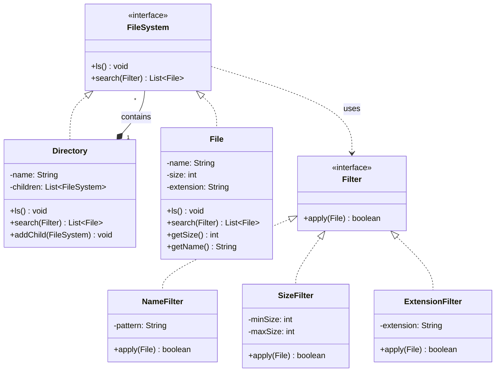

# File Storage System - Architecture

## Class Diagram

## Design Patterns

- **Composite Pattern**: `Directory` and `File` implement the same `FileSystem` interface, allowing uniform treatment
- **Strategy Pattern**: Different `Filter` implementations for flexible file searching

## Design Principles

1. **Single Responsibility**: Each class has one job
2. **Open/Closed**: New filters can be added without modifying existing code
3. **Dependency Inversion**: High-level modules depend on abstractions (`FileSystem`, `Filter`)

