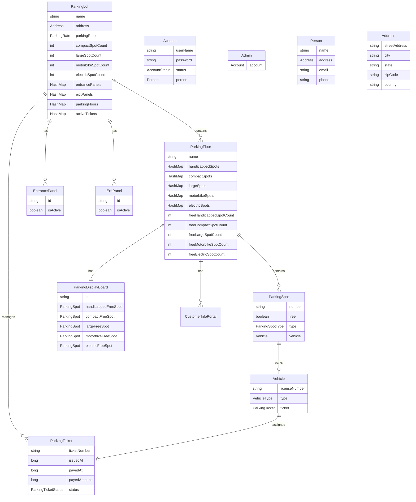

# Parking Lot System - Low Level Design

## Problem Statement

Design a parking lot system that can efficiently manage vehicle parking with the following requirements:

1. **Multi-level Structure**: The parking lot has multiple levels, with each level containing multiple rows of parking spots
2. **Vehicle Types**: Support for motorcycles, cars, and buses
3. **Spot Types**: Three types of parking spots - motorcycle spots, compact spots, and large spots
4. **Parking Rules**:
   - A motorcycle can park in any type of spot (motorcycle, compact, or large)
   - A car can park in either a single compact spot or a single large spot
   - A bus can park in five consecutive large spots within the same row

## Architecture Overview

The system follows object-oriented design principles with clear separation of concerns:

### Core Components

1. **ParkingLot**: Singleton class managing the entire parking system
2. **ParkingFloor**: Represents each level of the parking lot
3. **ParkingSpot**: Abstract base class for different types of parking spots
4. **Vehicle**: Abstract base class for different types of vehicles
5. **ParkingTicket**: Manages parking tickets and payment processing
6. **Entry/Exit Panels**: Handle vehicle entry and exit operations

### Key Features

- **Singleton Pattern**: Ensures only one parking lot instance exists
- **Strategy Pattern**: Different parking strategies for different vehicle types
- **Observer Pattern**: Real-time display updates when spots are occupied/freed
- **Factory Pattern**: Creating appropriate parking spots and vehicles

## Entity Relationship Diagram



## Class Structure

### Vehicle Hierarchy
```
Vehicle (Abstract)
├── Car
├── Bus
├── Truck
├── Van
└── Motorcycle
```

### Parking Spot Hierarchy
```
ParkingSpot (Abstract)
├── CompactSpot
├── LargeSpot
├── MotorbikeSpot
├── HandicappedSpot
└── ElectricSpot
```

### Enums
- **VehicleType**: CAR, BUS, TRUCK, VAN, MOTORCYCLE
- **ParkingSpotType**: HANDICAPPED, COMPACT, LARGE, MOTORBIKE, ELECTRIC
- **ParkingTicketStatus**: ACTIVE, PAID, LOST
- **AccountStatus**: ACTIVE, BLOCKED, BANNED, COMPROMISED, ARCHIVED, UNKNOWN

## Key Design Patterns Used

### 1. Singleton Pattern
```java
public class ParkingLot {
    private static ParkingLot parkingLot = null;
    
    private ParkingLot() { }
    
    public static ParkingLot getInstance() {
        if (parkingLot == null) {
            parkingLot = new ParkingLot();
        }
        return parkingLot;
    }
}
```

### 2. Factory Pattern
Used for creating appropriate parking spots and vehicles based on type.

### 3. Strategy Pattern
Different parking strategies for different vehicle types:
- Motorcycles: Can use any available spot
- Cars: Use compact spots first, then large spots
- Buses: Require 5 consecutive large spots in the same row

## Parking Logic

### Motorcycle Parking
- **Priority**: Motorcycle spots → Compact spots → Large spots
- **Rule**: Can park in any type of available spot

### Car Parking
- **Priority**: Compact spots → Large spots
- **Rule**: Occupies exactly one spot

### Bus Parking
- **Requirement**: Exactly 5 consecutive large spots in the same row
- **Rule**: Cannot park in compact or motorcycle spots
- **Validation**: All 5 spots must be on the same floor and row

## API Methods

### Core Parking Operations
```java
// Get new parking ticket
public synchronized ParkingTicket getNewParkingTicket(Vehicle vehicle)

// Check if parking is full for vehicle type
public boolean isFull(VehicleType type)

// Process exit and payment
public boolean processExit(ParkingTicket ticket)
```

### Management Operations
```java
// Add new parking floor
public void addParkingFloor(ParkingFloor floor)

// Add entrance/exit panels
public void addEntrancePanel(EntrancePanel panel)
public void addExitPanel(ExitPanel panel)
```

## Database Schema

The system assumes the following database tables:

### parking_lots
- id (PRIMARY KEY)
- name
- address_id (FOREIGN KEY)
- max_compact_spots
- max_large_spots
- max_motorbike_spots
- max_electric_spots

### parking_floors
- id (PRIMARY KEY)
- parking_lot_id (FOREIGN KEY)
- floor_name
- total_spots

### parking_spots
- id (PRIMARY KEY)
- floor_id (FOREIGN KEY)
- spot_number
- spot_type
- row_number
- is_free
- vehicle_id (FOREIGN KEY, nullable)

### vehicles
- id (PRIMARY KEY)
- license_number
- vehicle_type
- ticket_id (FOREIGN KEY, nullable)

### parking_tickets
- id (PRIMARY KEY)
- ticket_number (UNIQUE)
- vehicle_id (FOREIGN KEY)
- issued_at
- paid_at (nullable)
- paid_amount (nullable)
- status

## Error Handling

The system includes comprehensive error handling:

- **ParkingFullException**: When no spots available for vehicle type
- **InvalidSlotNumberException**: When accessing non-existent parking spot
- **NoEmptySlotAvailable**: When specific spot type is full
- **VehicleNotFoundException**: When vehicle not found during exit

## Future Enhancements

1. **Real-time Analytics**: Parking usage patterns and optimization
2. **Mobile App Integration**: QR code based entry/exit
3. **Payment Gateway**: Multiple payment options
4. **Reservation System**: Advance booking of parking spots
5. **Electric Vehicle Charging**: Integration with charging stations
6. **Dynamic Pricing**: Price adjustment based on demand
7. **Multi-tenant Support**: Multiple parking lot management

## Getting Started

### Prerequisites
- Java 17 or higher
- Maven 3.6 or higher

### Build and Run
```bash
# Clone the repository
git clone <repository-url>

# Navigate to project directory
cd ParkingLot

# Build the project
mvn clean compile

# Run tests
mvn test

# Package the application
mvn package
```

### Usage Example
```java
// Get parking lot instance
ParkingLot parkingLot = ParkingLot.getInstance();

// Create a vehicle
Vehicle car = new Car();
car.setLicenseNumber("ABC-123");

// Get parking ticket
try {
    ParkingTicket ticket = parkingLot.getNewParkingTicket(car);
    System.out.println("Ticket issued: " + ticket.getTicketNumber());
} catch (ParkingFullException e) {
    System.out.println("Parking is full for this vehicle type");
}
```

## Contributing

1. Fork the repository
2. Create a feature branch
3. Commit your changes
4. Push to the branch
5. Create a Pull Request

## License

This project is licensed under the MIT License - see the LICENSE file for details.